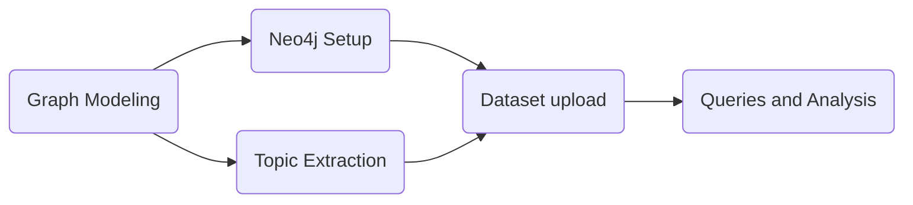

# Metaculus Topic Engine

This project is produced in the framework of the Metaculus One Million Predictions Hackathon.

### Goal
Determine if an NLP-driven Topic Engine that identifies the most important topics in Metaculus questions and creates a knowledge graph with their key relationships could be used to improve the science of forecasting.

### Methodology

First, the graph is model to represent the relationships between the important entities of the Metaculus dataset structure, then a Neo4j database is setup and the extraction of the topics is executed. Finally, the new dataset with the topics included is uploaded to Neo4j and then the queries can be applied to performed analysis.

### Use requirements
For running the Python scripts and notebooks, it is suggested to use a [Python Virtual Environmet](https://docs.python.org/3/library/venv.html) and install the [requirements.txt](requirements.txt) file, by running:
```
pip install -r requirements.txt
```
For running a Neo4j database locally, it is necessary to user Docker and follow the instructions on the **Neo4j Setup** section.

## Graph Modeling
For the Metaculus dataset, the following graph is considered as the base for the helper classes and structure in Neo4j. 

****
Both nodes and relationships can storage data, so the weight of the relationships and useful data can be expressed as relationship or node parameters. The node definition is more rigid, but more relationship types could be added in future releases, such as a direct relationship between User and Topic, for analyzing the User domain skills easily.

## Neo4j Setup
The Graph Database used for the project is [Neo4j](https://neo4j.com/). There is  a public docker image that contains the community edition of Neo4j and can be used locally.

1. Use docker to build and run a local neo4j instance using the following command:

```
docker run \
--name testneo4j \
-p7474:7474 -p7687:7687 \
-d \
-v $HOME/neo4j/data:/data \
-v $HOME/neo4j/logs:/logs \
-v $HOME/neo4j/import:/var/lib/neo4j/import \
-v $HOME/neo4j/plugins:/plugins \
--env NEO4J_AUTH=neo4j/test \
neo4j:latest
```
The port 7474 is used for the web interface of the Neo4j browser, it can be accesed in *http://localhost.com:7474*. The  port 7687 is used for API calls. A default database is created and the root user is *neo4j*, with password *test* .

## Topic extraction
The extraction of the entities that are considered as topics is performed by taking every question's title and description and using the [Wikifier](https://wikifier.org/info.html) API for getting the annotations within each text. A JSON dataset with the extracted topics for each question is generated.

The amount of detected topics vary depending on the [page rank](https://en.wikipedia.org/wiki/PageRank) applied for filtering the entities. Each entity contains a lot of references to Wikifier and DBpedia classes and depending on the parameter of the requests, the obtained data can be large, therefore it is recommeded to do batch requests. The capabilities of Wikifier can be tested in their [demo tool](https://wikifier.org).

The example code alogside the description of the process can be found in this [jupyter notebook](topic_extraction/extract_topics.ipynb).
  
## Dataset upload
For transforming the enriched dataset (questions and predictions dataset + topics) into a full graph within Neo4j, it is necessary to extract the data, turning it into nodes and relationships.

The graph is built using helper classes, one for the node creation and one for the relationship between creation. As each type of node and relationship rely on extracting the proper data from the datasets, there is method for build each type of node and relationship.

The library **py2neo** is used to facilitate the graph building, using Cypher queries directly. With this setup, it is possible to easily connect a local Neo4j instance or a production Neo4j database, just by replacing the host, port, user and password.

The example code alogside the description of the process can be found in this [jupyter notebook](graph_building/build_graph.ipynb).

## Queries and Analysis
After uploading the dataset to Neo4j, it is possible to perform Cypher queries for analyzing the graph dynamics and structure. There are several analysis that can be perfomed with the given graph structure by using queries, such as getting analyzing the user expertise by checking his/her favorite topics, suggest subcategories by looking at the most popular topics, etc.

These queries can be performed directly on the Neo4j browser or using **py2neo** as shown in this [jupyter notebook](graph_analysis/analyze_graph.ipynb).

### Get basic information from the Graph
* Get all nodes and all relationships
````
MATCH (a) RETURN (a)
````

* Get all the Topic nodes
````
MATCH (n:Topic) RETURN (n)
````

* Count the amount of User nodes
```
MATCH (n:User) RETURN count(n) AS count
```

* Get all the HAS relationships (Question-Topic)
````
MATCH ()-[r:HAS]->() RETURN (n)
````

* Count the amount of CONTAINS relationships (Category-Topic)
```
MATCH ()-[r:CONTAINS]->()
RETURN count(r) as count
```

### Perform complex queries
* Get all the predictions made by a given user
```
MATCH (u:User)-[p:PREDICTS]-() RETURN DISTINCT(u)
```
* Get the 10 most popular topics (topics with most relationships)
```
MATCH (a:Topic)-[r]-()
RETURN a, COUNT(r) as num
ORDER BY num DESC LIMIT 10
```
* Get the top 5 favorite topics of a given user
```
MATCH (u:User)-[p:PREDICTS]-(q:Question)-[h:HAS]-(t:Topic) 
WHERE u.user_id=124344 RETURN u,p,q,h,t, 
COUNT((t)) as num ORDER BY num DESC LIMIT 5
```
* Get the top 5 favorite categories of a given user
```
MATCH (u:User)-[p:PREDICTS]-(q:Question)-[b:BELONGSTO]-(c:Category) 
WHERE u.user_id=124344 RETURN u,p,q,b,c, 
COUNT(c) as num ORDER BY num DESC LIMIT 5
```
